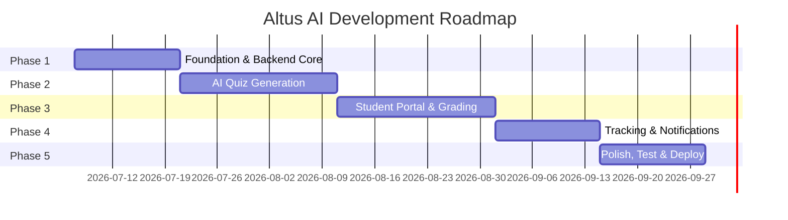

# Altus AI — Phased Implementation Plan

A structured development roadmap broken into 5 phases across a **3-folder monorepo architecture**.

---

## Final Tech Stack

| Layer | Technology |
|---|---|
| Frontend | React, Next.js, Tailwind CSS, Zustand |
| Backend | Python, Flask |
| AI Agent | Minimax-M3 (via HuggingFace) |
| Database | PostgreSQL (Neon Serverless) |
| Auth | Firebase Authentication |
| Storage | Cloudinary |
| Hosting | Render |

## Monorepo Structure

```
altus-ai/
├── frontend/        # React + Next.js UI (Teacher & Student dashboards)
├── backend/         # Flask REST API, DB models, Auth middleware
├── altus-agent/     # AI/LLM microservice (quiz generation, auto-grading)
├── .env
├── .gitignore
├── PRD.md
├── ARCHITECTURE.md
└── README.md
```

| Folder | Responsibility |
|---|---|
| `frontend/` | All UI — login, dashboards, quiz-taking, gradebook, tracking |
| `backend/` | REST API, database ORM, authentication, business logic |
| `altus-agent/` | Standalone AI service — text extraction, LLM calls, grading logic |

> **Design Decision:** `altus-agent/` is separated from `backend/` so the AI pipeline is independently testable, deployable, and swappable if the model changes.

---

## Phase 1: Project Foundation & Backend Core
**Duration:** ~1–2 weeks
**Branch:** `phase1/foundation`
**Goal:** Scaffold all 3 folders, set up DB schema, authentication, and basic API.

### `backend/` Tasks
- [ ] Initialize Flask project with virtual environment
- [ ] Configure SQLAlchemy + Alembic for migrations
- [ ] Design and create database tables:
  - `users` (id, email, name, role: teacher/student/admin, firebase_uid)
  - `schools` (id, name)
  - `classes` (id, school_id, teacher_id, name, subject)
  - `students_classes` (student_id, class_id) — join table
  - `assignments` (id, class_id, teacher_id, title, created_at, due_date)
  - `quizzes` (id, assignment_id, questions_json, source_type, source_url)
  - `submissions` (id, quiz_id, student_id, answers_json, score, submitted_at, graded_at)
- [ ] Integrate Firebase Admin SDK — auth middleware to verify tokens
- [ ] Implement role-based access control (Teacher, Student, Admin)
- [ ] Core API endpoints:
  - `POST /api/auth/register` — Register user & sync with DB
  - `GET /api/users/me` — Get current user profile
  - `POST /api/classes` — Teacher creates a class
  - `GET /api/classes` — List teacher's classes
  - `POST /api/classes/:id/students` — Add students to a class

### `altus-agent/` Tasks
- [ ] Initialize Python project with its own `requirements.txt`
- [ ] Set up project structure (`/agent`, `/utils`, `/config`)
- [ ] Basic health-check endpoint (`GET /health`)
- [ ] Configure HuggingFace API client with Minimax-M3

### `frontend/` Tasks
- [ ] Scaffold Next.js app (`npx create-next-app`)
- [ ] Install & configure Tailwind CSS, Zustand
- [ ] Set up Firebase Auth (sign-up, login, logout flows)
- [ ] Build login/signup pages
- [ ] Build placeholder teacher dashboard shell (sidebar + header layout)

### Phase 1 Deliverable
> Running backend with auth + DB, agent service with health check, and frontend with login flow and dashboard shell.

---

## Phase 2: AI-Powered Quiz Generation (Core Feature)
**Duration:** ~2–3 weeks
**Branch:** `phase2/ai-quiz-generation`
**Goal:** Implement the "Magic Curriculum-to-Quiz" pipeline.

### `backend/` Tasks
- [ ] File upload endpoint (`POST /api/upload`) → saves to Cloudinary, returns URL
- [ ] Assignment creation endpoint (`POST /api/assignments`)
- [ ] Quiz generation trigger (`POST /api/assignments/:id/generate-quiz`)
  - Calls `altus-agent` internally, saves result to `quizzes` table
- [ ] Quiz retrieval (`GET /api/quizzes/:id`)

### `altus-agent/` Tasks
- [ ] **Text Extraction Module:**
  - PDF text extraction (`PyMuPDF` or `pdfplumber`)
  - Raw text passthrough
  - Webpage scraping (`BeautifulSoup` or `trafilatura`)
- [ ] **Quiz Generation Module:**
  - Prompt engineering for structured JSON output (MCQ + short answer)
  - Grade-level / age-appropriateness parameters
  - HuggingFace Inference API integration with Minimax-M3
  - Response parsing and JSON validation
- [ ] API endpoint: `POST /generate-quiz` (accepts text, returns quiz JSON)

### `frontend/` Tasks
- [ ] "Create Assignment" page with 3 input modes (Upload PDF, Paste Text, Link URL)
- [ ] Drag-and-drop file upload component
- [ ] Loading state with progress indicator (target: < 15 seconds)
- [ ] Quiz preview screen (view generated questions)
- [ ] Edit/regenerate individual questions
- [ ] "Publish to Class" button

### Phase 2 Deliverable
> Teachers can upload material → AI generates quizzes → preview and publish to a class.

---

## Phase 3: Student Portal & Auto-Grading
**Duration:** ~2–3 weeks
**Branch:** `phase3/student-portal-and-autograding`
**Goal:** Build the student quiz experience and automatic grading engine.

### `backend/` Tasks
- [ ] `GET /api/students/quizzes` — List assigned quizzes for a student
- [ ] `GET /api/quizzes/:id/take` — Get quiz questions (no answers exposed)
- [ ] `POST /api/quizzes/:id/submit` — Submit answers, trigger grading via agent
- [ ] `GET /api/classes/:id/gradebook` — Teacher gradebook data
- [ ] `GET /api/submissions/:id` — Detailed submission view
- [ ] CSV export endpoint for grades

### `altus-agent/` Tasks
- [ ] **Auto-Grading Module:**
  - MCQ grading (exact match against correct answers)
  - Short-answer AI grading via Minimax-M3 (compare student answer to model answer, return score + feedback)
- [ ] API endpoint: `POST /grade-submission` (accepts answers + rubric, returns scores + feedback)

### `frontend/` Tasks
- [ ] Student dashboard — list of assigned quizzes with status
- [ ] Quiz-taking interface (scrollable or one-at-a-time)
- [ ] Optional timer (teacher-configured)
- [ ] Post-submission feedback screen (score + per-question feedback)
- [ ] Teacher Gradebook view — students × assignments × scores table
- [ ] Individual submission detail view
- [ ] Class analytics (average score, distribution chart using a charting library)

### Phase 3 Deliverable
> Students take quizzes and get instant AI feedback. Teachers see auto-populated gradebooks with analytics.

---

## Phase 4: Submission Tracking & Notifications
**Duration:** ~1–2 weeks
**Branch:** `phase4/submission-tracking-and-notifications`
**Goal:** Build submission tracking dashboard and automated reminders.

### `backend/` Tasks
- [ ] `GET /api/assignments/:id/tracking` — Submission status per student
- [ ] `POST /api/assignments/:id/remind` — Send reminders for missing submissions
- [ ] `POST /api/assignments/:id/remind-all` — Bulk remind all missing students
- [ ] Notification log table and endpoints
- [ ] Email integration (Resend or Firebase Extensions)

### `altus-agent/` Tasks
- [ ] *(No new agent work in this phase)*

### `frontend/` Tasks
- [ ] Submission tracking dashboard per assignment
  - Visual indicators: ✅ Submitted, ❌ Missing, ⚠️ Late
  - Filter/sort by class, assignment, date range
- [ ] "Send Reminder" button (single student) and "Remind All" (bulk)
- [ ] Notification log view (what was sent and when)
- [ ] Student in-app notification center (new quizzes, reminders, grades)

### Phase 4 Deliverable
> Teachers have full visibility into submissions and can send automated reminders with one click.

---

## Phase 5: Polish, Testing & Deployment
**Duration:** ~1–2 weeks
**Branch:** `phase5/polish-and-deploy` (merged into `dev-phases` → `main`)
**Goal:** Production-readiness across all 3 services.

### `backend/` Tasks
- [ ] Unit tests (pytest) for all API endpoints
- [ ] Integration tests for the backend ↔ agent communication
- [ ] API rate limiting (Flask-Limiter)
- [ ] Input sanitization, CORS configuration
- [ ] DB query optimization & indexing
- [ ] Deploy to Render as a Web Service

### `altus-agent/` Tasks
- [ ] Unit tests for text extraction module
- [ ] Unit tests for quiz generation (mock LLM responses)
- [ ] Unit tests for grading module
- [ ] Deploy to Render as a separate Web Service

### `frontend/` Tasks
- [ ] Responsive design (mobile, tablet, desktop)
- [ ] Dark mode support
- [ ] Loading skeletons, micro-animations, empty states
- [ ] Error handling & user-friendly messages
- [ ] Accessibility audit (ARIA labels, keyboard nav)
- [ ] Component tests (React Testing Library)
- [ ] E2E tests (Playwright or Cypress)
- [ ] Lighthouse performance audit
- [ ] Deploy to Render as a Static/Web Service

### Cross-Cutting
- [ ] Configure environment variables on Render for all 3 services
- [ ] Set up custom domain (if applicable)
- [ ] CI/CD: Auto-deploy on push to `main`

### Phase 5 Deliverable
> Production-ready, deployed application with CI/CD, accessible via a public URL.

---

## Timeline Summary



| Phase | Focus | Duration | Branch |
|-------|-------|----------|--------|
| **1** | Foundation, DB, Auth, Scaffolding | 1–2 weeks | `phase1/foundation` |
| **2** | AI Quiz Generation | 2–3 weeks | `phase2/ai-quiz-generation` |
| **3** | Student Portal & Grading | 2–3 weeks | `phase3/student-portal-and-autograding` |
| **4** | Tracking & Notifications | 1–2 weeks | `phase4/submission-tracking-and-notifications` |
| **5** | Polish, Test & Deploy | 1–2 weeks | `phase5/polish-and-deploy` |
| **Total** | | **~8–12 weeks** | Merge into `dev-phases` → `main` |

## Git Workflow

```
main (production)
 └── dev-phases (integration)
      ├── phase1/foundation
      ├── phase2/ai-quiz-generation
      ├── phase3/student-portal-and-autograding
      ├── phase4/submission-tracking-and-notifications
      └── phase5/polish-and-deploy
```

Each phase branch merges into `dev-phases` via PR upon completion. Final merge from `dev-phases` → `main` for production release.
